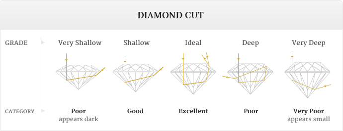
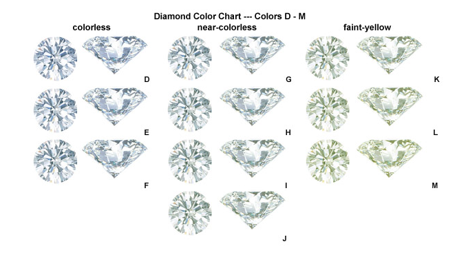
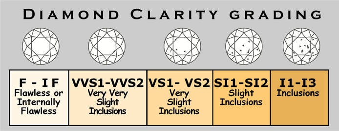
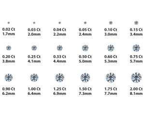
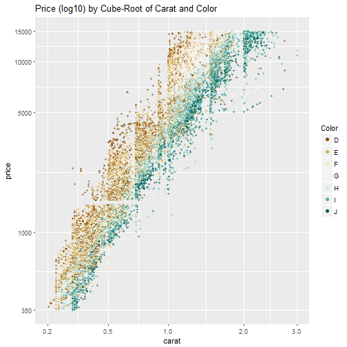

Price Your Diamond
======================================================
author: George Vu 
date: 4/30/2017
autosize: true

Introduction
========================================================
Have you ever wondered how much you should actually pay for a diamond?

Do you understand how carat, cut, clarity, and color affect the price of a diamond?  

The diamond pricing app will give you a rough idea of what a diamond should cost.

The 4 C's of Diamond Quality
========================================================
<table border="0">
<tr>
  <td>
    
  </td>
  <td>
    
  </td>
</tr>
<tr>
  <td>
  The better a diamond is cut, the more sparkle it will have.
  </td>
  <td>
  The more colorless the diamond, the higher quality grade it will receive.
  </td>
<tr>
  <td>
    
  </td>
  <td>
    
  </td>
</tr>
<tr>
  <td>
  Diamonds with few or no imperfections receive the highest clarity grades.
  </td>
  <td>
  Carat is specifically a measure of a diamond's weight.
  </td>
</table>
  </td>
</tr>
</table>

The Diamonds Dataset
========================================================

- The diamonds dataset contains prices and other attributes of almost 54,000 diamonds.

- Carat Range 0.2 to 5.01

- Color Range D to J

- Clarity Range: SI2 to IF

- Cut Range: Ideal to Fair

How the Dimaond Pricing App Works
========================================================
- The diamond pricing application runs in a web browser and takes the 4 C's inputs and estimates the price of the diamond according to the Diamonds dataset.

- The application models the prices against the cut, clarity, color, and carat and outputs a predicted price based on your input.

The Diamond Pricing Data
========================================================

